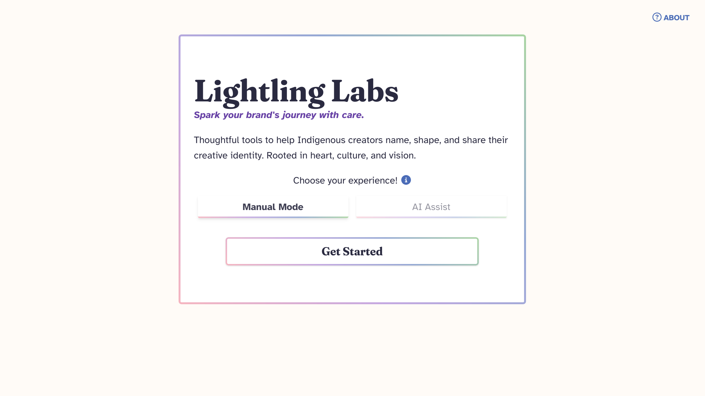
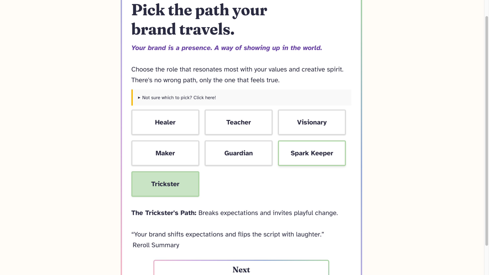
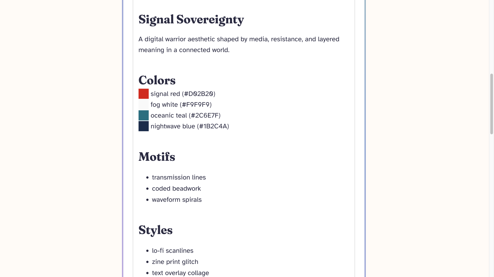

# Lightling Labs ⚡️

_Build your brand with clarity, culture, and creative ease._

**Lightling Labs** is an empowering, cozy platform designed for Indigenous creators, solopreneurs, and small business owners to build beautiful brands and digital presences. Whether starting a community-based initiative or launching a dream side hustle, Lightling Labs helps give guidance through brand-building with warmth and simplicity.

---

## Overview ✨

Lightling Labs is a full-stack application currently in development as part of my personal web developer portfolio! It's both a learning playground and a project with heart. It is centered around creative independence, cultural grounding, and tech empowerment!

**Core ideas:**

- AI assisted brand name suggestions & taglines
- Curated brand mood/color selections
- Responsive UI with handcrafted styling (no utility frameworks)
- Built with growth and future features in mind

---

## 📸 Screenshots

### 🌱 Welcome Screen



### 🛤️ Brand Type Selection



### 🎨 Aesthetic Summary



---

## Features:

- **Brand Type Selection**  
  Friendly, guided page where users select their brand type with visual and descriptive support.

- **Mood & Color Tag Picker**  
  Helps users communicate the emotional tone and visual direction of their brand.

- **AI Powered Brand Name & Tagline Generator**  
  Suggests names and taglines tailored to brand type, mood, and color groups.

- **Organized Suggestions by Theme**  
  Name suggestions are categorized (e.g. Dreamy, Grounded, Mystical) and include meanings, summary tags, and taglines.

- **Full-Stack Architecture**

  - **Front-end**: Built with React + Sass for styled, component-based UIs.
  - **Back-end**: Node.js + Express to handle routes, serve data, and process future AI functionality.

- **Mobile-First & Responsive Design**  
  Designed for all screen sizes and accessibility in mind.

- **Future Theme Options**  
  Planned support for dark mode, and more accessibility features (currently searching for an accessibility program/course to learn more.) Also, implementing Axios.

---

## Tech Stack

**Frontend**  
  
  


**Backend**  
  


---

## Getting Started

### Prerequisites

Make sure you have the following installed:

- [Node.js](https://nodejs.org/) (v18+ recommended)
- [Git](https://git-scm.com/)
- A package manager (`npm` or `yarn`)
- A `.env` file with any necessary environment variables (see example below)

### 📦 Clone and Install

```bash
git clone https://codeberg.org/your-username/lightling-labs.git
cd lightling-labs

# Frontend
cd client
npm install

# Backend
cd ../server
npm install

```

---

## Running the App Locally

```bash
cd server
npm run dev  # or: node index.js

cd ../client
npm run dev

```

The app will be available at http://localhost:5173 (or Vite’s default port).

### Environment Vairables

There is a .env.sample file with required secrets.
Create a .env file in the /server with your secrets.
